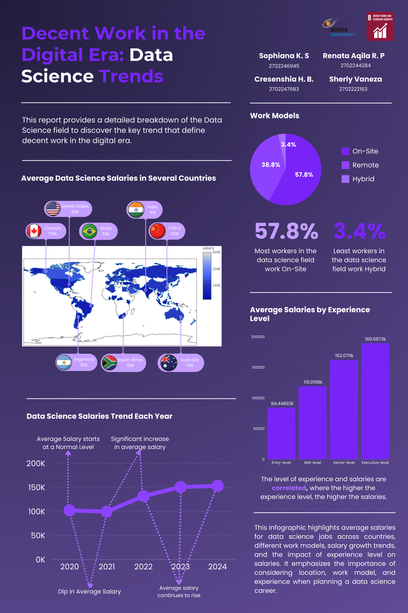

# Decent Work in the Digital Era: Data Science Trends

This is the **final group project** for the SDG case study focusing on **Sustainable Development Goal (SDG) 8: Decent Work and Economic Growth**.  
Our goal is to analyze global **Data Science employment trends** and present them as an informative infographic.

## Project Overview
The project explores how data science jobs contribute to decent work in the digital era.  
Using the [Data Science Salary 2021–2023 dataset](https://www.kaggle.com/datasets/harishkumardatalab/data-science-salary-2021-to-2023), we examine **salary distributions**, **work models**, and **experience-level effects** across countries to uncover key trends supporting SDG 8.

## Key Insights
- **Average Salaries by Country**: Data science salaries vary significantly worldwide, with the highest averages observed in countries like Canada, Australia, and the United States.
- **Salary Trends Over Time**: From 2020 to 2024, salaries have generally increased, showing the growing demand and value of data science professionals.
- **Work Models**: 57.8% of data science professionals work on-site, 38.8% work remotely, and 3.4% use hybrid models.
- **Experience and Salary**: Higher experience levels consistently correlate with higher salaries, highlighting the value of skill development.

## Methodology
- **Data Understanding & Preparation**: Analyzed and cleaned the dataset of 6,600 records and 11 features (job title, experience level, employment type, work models, work year, employee residence, salary in USD, etc.).
- **Visualization**: Created interactive and static visualizations using R (ggplot2, Plotly, Leaflet) to represent salary distributions, job types, and work models across countries and years.
- **Infographic Design**: Composed a clear, A3-style infographic summarizing key findings and insights.

## Team Members
- Renata Aqila Ridha Putri
- Cresenshia Hillary Benida
- Sherly Vaneza – 2702222163
- Sophiana Kassandria Sukamto

## Conclusion
Our analysis highlights the dynamic landscape of data science employment, illustrating how factors such as location, work model, and experience level influence salaries.  
These insights align with **SDG 8** by demonstrating how data science offers promising opportunities for decent work and sustainable economic growth.
